Drupal8 企业站前端简易心得
========================

本文是以前端方面企业建站的角度所总结的一些经验之谈，并不是讲Drupal的基础入门文章。

##正文

企业网站一般是由首页、各种CMS页面、表单提交页面以及动态新闻页面等组成，制作也是以首页开始，下面主要以首页的形式开始介绍。

###1.导航

Drupal8的导航菜单一般是先在`info.yml`文件里声明区块，再在`twig`文件里调用相应区块，然后在后台创建一个自己想要的菜单，最后在相应区块里调用这个菜单即可。

例如，在默认的bootstrap主题模板中，是在bootstrap主题目录下的`bootstrap.info.yml`文件里声明好导航区块，再在`/templates/system/page--front.html.twig`和`page.html.twig`文件里调用`page.navigation`和`page.navigation_collapsible`区块，然后在后台 `管理-结构-菜单` 里新建一个菜单（bootstrap主题默认是`Main navigation`）并编辑成自己想要的导航菜单，最后在 `管理-结构-区块布局` 里的对应区块里放入写好的导航菜单。

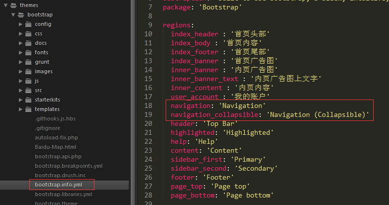

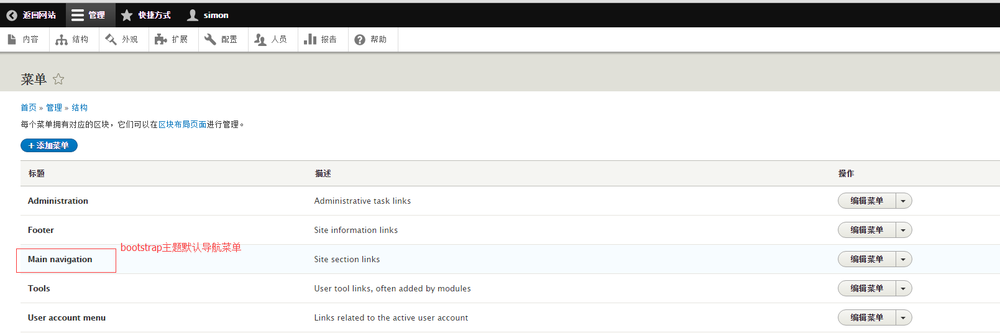

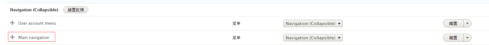

附：着手页面开发时，记得把debug信息打开（默认在`service.yml`文件中），可以看到当前版块所用的`twig`模板文件位置，前面带“x”表示当前引用模板，带“*”表示可选用模板，这时候就可以根据它的提示来自定义模板或者选用默认的模板。

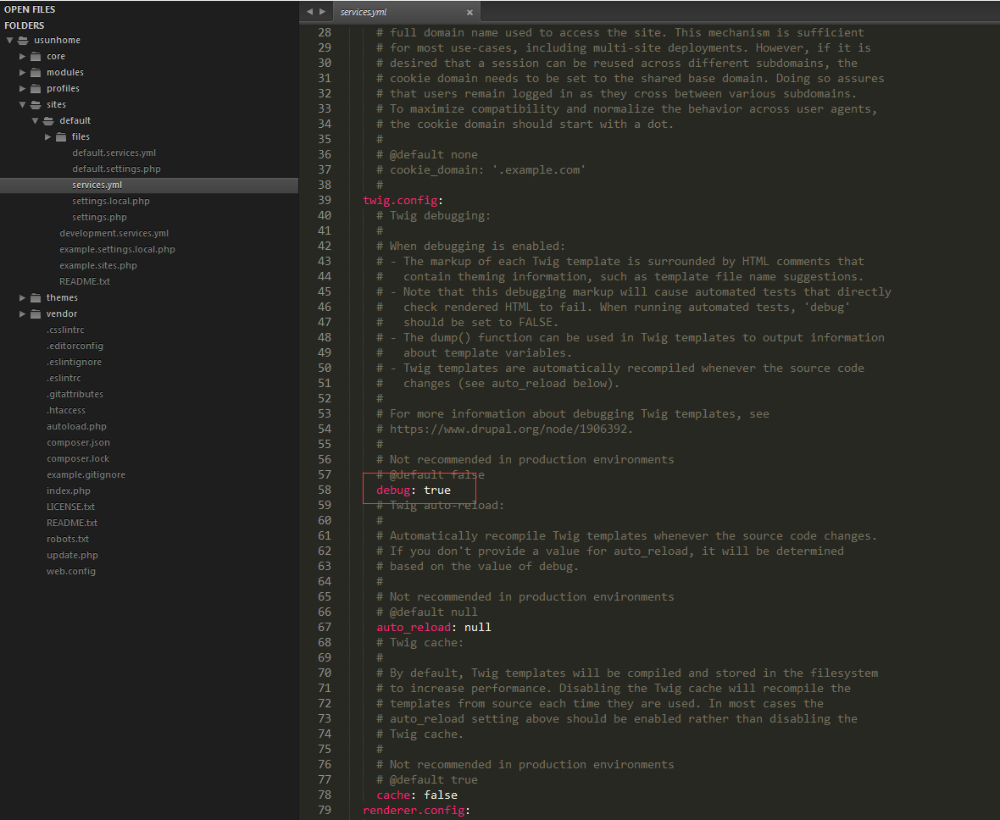

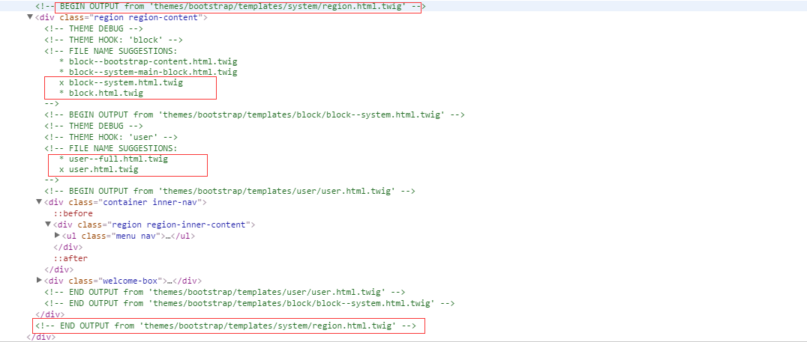

另外，就bootstrap主题来说，导航菜单默认是点击弹出二级菜单，要换成鼠标悬浮显示二级菜单可用 **Bootstrap Hover Dropdown** 插件。
[Bootstrap Hover Dropdown- github 点这里](https://github.com/ibmsoft/twitter-bootstrap-hover-dropdown)

代码如下：

    ;(function($, window, undefined) {
      // outside the scope of the jQuery plugin to
      // keep track of all dropdowns
      var $allDropdowns = $();

      // if instantlyCloseOthers is true, then it will instantly
      // shut other nav items when a new one is hovered over
      $.fn.dropdownHover = function(options) {

          // the element we really care about
          // is the dropdown-toggle's parent
          $allDropdowns = $allDropdowns.add(this.parent());

          return this.each(function() {
              var $this = $(this).parent(),
                  defaults = {
                      delay: 500,
                      instantlyCloseOthers: true
                  },
                  data = {
                      delay: $(this).data('delay'),
                      instantlyCloseOthers: $(this).data('close-others')
                  },
                  options = $.extend(true, {}, defaults, options, data),
                  timeout;

              $this.hover(function() {
                  if(options.instantlyCloseOthers === true)
                      $allDropdowns.removeClass('open');

                  clearTimeout(timeout);
                  $(this).addClass('open');
              }, function() {
                  timeout = setTimeout(function() {
                      $this.removeClass('open');
                  }, options.delay);
              });
          });
      };
      $('[data-hover="dropdown"]').dropdownHover();
    })(jQuery, this);

注： 在插件前面加了个分号，增加了插件的兼容性，因为可能上一个js代码没写分号，如果在此不加分号则可能因为没换行导致js出错。

同时，注意官方用法提到的：

`Add data-hover="dropdown" in addition (or in place of) Bootstrap's data-toggle="dropdown".`

插件支持HTML元素data-*传参，也支持初始化传参。将此js代码放在bootstrap原本的js代码后面执行即可。

###2.Banner

企业站的Banner图一般首页是以轮播形式，内页没有或者以一张固定图的形式展示。

#####首页的banner
在首页的`twig`模板文件里直接以html代码的形式添加，或者以添加自定义区块的形式添加。

以bootstrap主题框架为例

直接在主题目录下的`templates/system/page--front.html.twig`文件里的相应位置添加上写好的html代码

或者在`page--front.html.twig`文件里调用已经声明好的 `首页广告图` 区域，在后台的 `管理-结构-区块布局-自定义区块` 里新建一个 `首页banner` 区块并添加好已编辑好的html代码，然后在区块布局里的`Banner`区块里放入自定义的 `首页banner`。

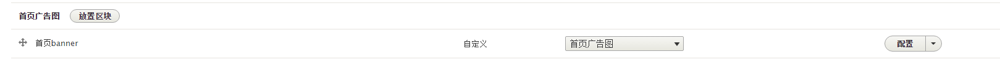

两种方法适应于不同情况，且各有优劣，请自行体会。

#####内页的banner

内页的Banner一般是一张固定图配以当前页面的介绍文字

同首页的一样两种方法均可，但是内页上当前页面的介绍文字（如果有的话）建议以自定义区块形式添加，虽然前期开发的过程略繁琐，但是各页面区块独立互不影响，便于后期维护与修改。

另外，**区块布局里的各区块（包括网站主体内容区块、侧边栏区块以及footer区块等等）都可自行配置显示于哪些页面，隐藏于哪些页面，这个功能用处很大。**

###3.首页主体内容

导航跟Banner处理完毕之后，就是首页的主题内容了，设计稿一般也是以区块的形式划分的，同Banner一样，既可以直接在首页`twig`文件里直接添加html代码，也可以用自定义区块的形式添加，这里建议使用后者。

一些静态的区块很好处理，复杂一点的比如首页要展示一个动态新闻列表，里面包含最新发布的几篇新文章，这个就需要后端大神配合用php代码自定义模板来实现。

###4.footer

bootstrap主题里的footer也是默认以区块形式添加的，再在区块布局里自行配置相关设置，与大部分CMS页面一样，基本都是纯静态页面，比较简单。

首页说完了，下面说下其他页面的制作经验。

###5.动态新闻类页面

在企业站点的构建中，新闻页面一般包含企业新闻、行业观点、市场动态等等。

拿“市场动态”举例，要创建一个这样的新闻页面，首先要在后台 `管理-结构-内容类型` 里添加一个内容类型，名为“市场动态”，添加完毕后对其进行配置。

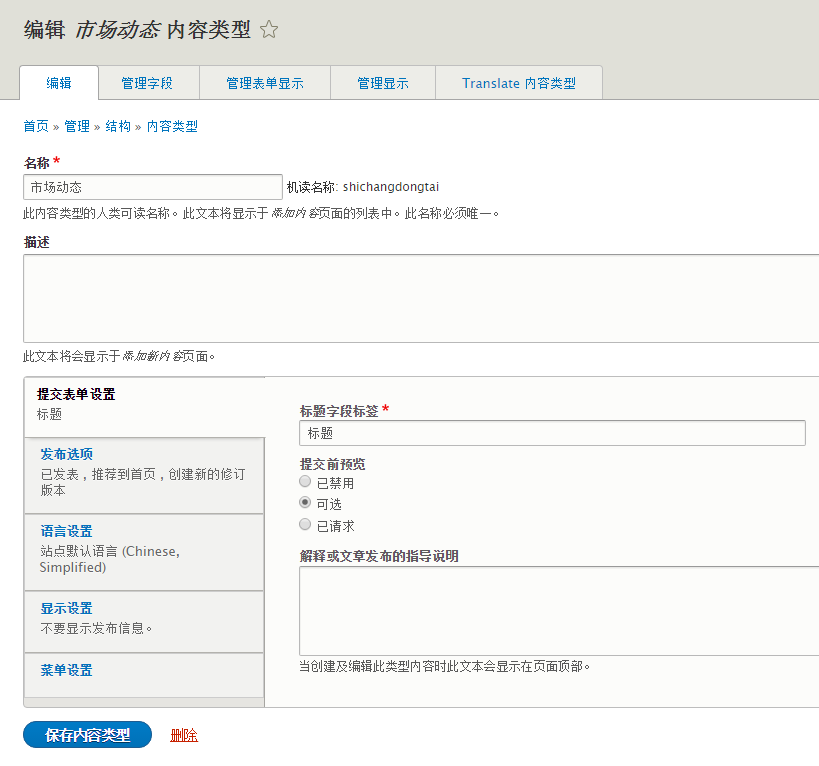

#####内容类型

- 管理字段

一般的新闻页面应该包括新闻标题、新闻的发表日期、列表页的缩略图以及新闻的摘要等等，这些都需要先在 `管理字段` 里添加相应的字段。

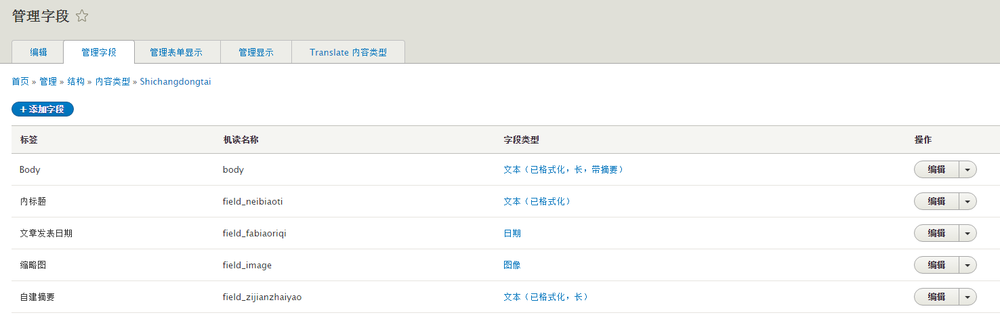

- 管理表单显示

字段添加完毕以后，在 `管理表单显示` 里对这些字段进行设置，这里的设置是针对发布新文章、编辑文章的时候页面的显示情况。

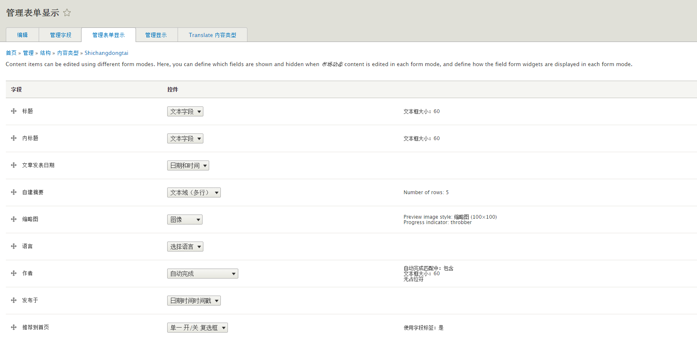

- 管理显示

同样是对已有字段进行设置，这里的设置是针对新闻详情页的显示情况。

#####视图

内容类型设置完毕以后，还需要对新闻列表页进行设置。

在后台， `管理-结构-视图` 里添加视图，类型选择“市场动态”，生成一个页面，就可以开始进行配置了。

在字段里添加好新闻列表页要展示的字段，并按照设计稿排好顺序即可，同时也可自定义每个字段的格式、html外标签以及css类等。

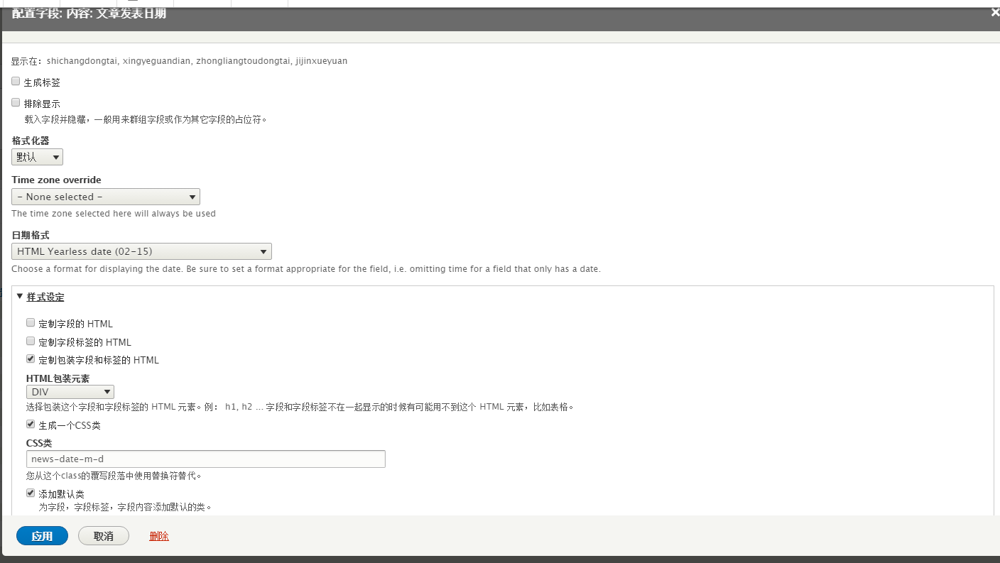

另外，在本页面还可以设置新闻列表页的新闻排序规则（按发表日期排序等等）、分页器（一页显示多少条新闻）等等。

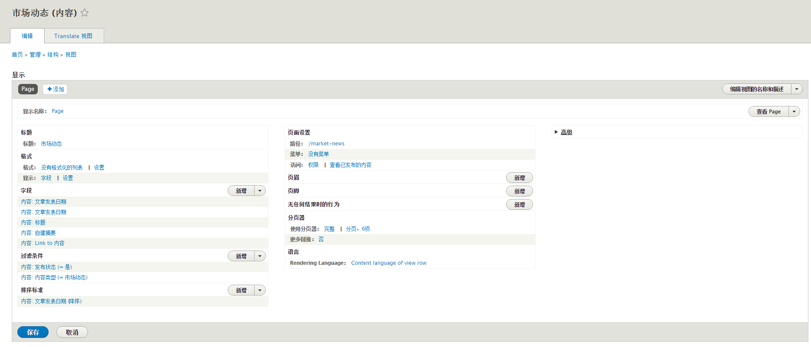

这些都设置好了，就可以开始写新闻列表页的css了。

#####发布新文章

当上面这些都设置完毕以后，开始发布新文章。

以“市场动态”为例：

在后台的 `管理-内容-添加内容` 中，选择已经编辑好的“市场动态”，就可以开始新文章的编辑了。

- 右侧的 `创建新的修订版本` 勾选以后，你的每次修改保存后台都会自动帮你记录在案，在 `修订版本` 中可随时恢复，这一点和git很像。

- 右侧有一个菜单设置，可指定一个菜单链接，效果就是相当于在指定菜单中添加了一个新的链接。

- 右侧的URL路径设置，可为这篇文章设置一个别名URL地址。
（这几项在基本页面的编辑中也适用）

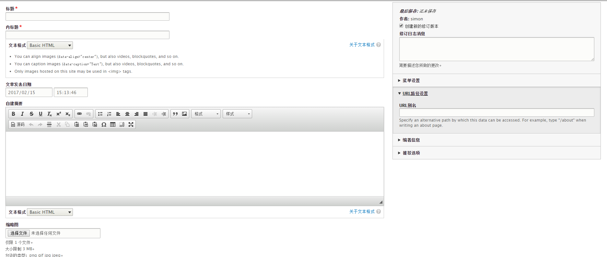

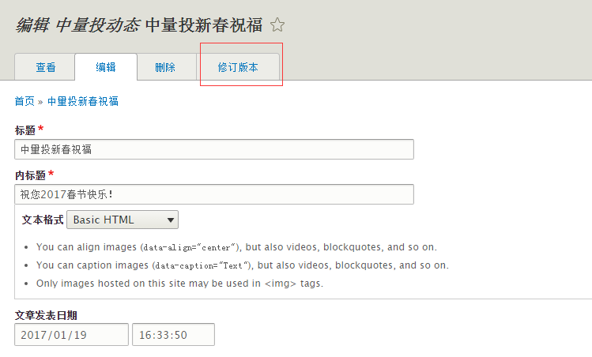

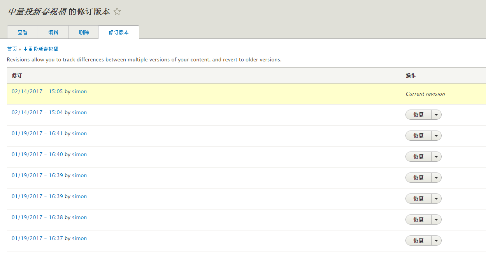

说到这里，再顺带**说说编辑器的事**

目前为止，所做的项目里，都是用的 `ckeditor` 编辑器。

在后台 `配置-文本格式和编辑器` 里，对文本格式进行配置。

**注： 开发过程中写在后台配置里的CMS页面的html代码一般采用“完全的HTML”格式，动态文章编辑选用“基本的HTML”（这个区别在人员权限配置里会起到作用，后面会讲到。）**

因为编辑器基本只是在编辑文章的时候用到，所以只对 `基本的HTML` 格式做介绍。

在工具栏配置中，将要启用的工具拖到 `启用的工具栏` 中，然后在 `CKEditor插件设置
` 里的 `Styles dropdown` 中添加自定义css类名，设置完毕后，在编辑文章的时候，就可选用自定义的文字样式了，这里就不截图了。

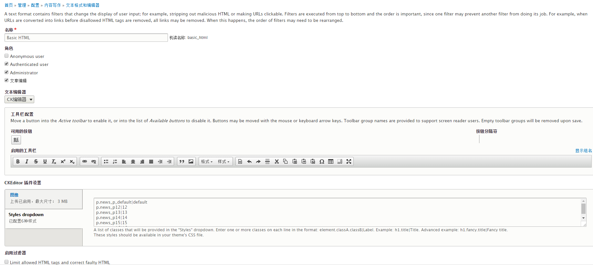

###6.后台配置

企业站前端页面的展示配置差不多说完了，再聊一下Drupal8的后台配置。

- 账号权限

一个企业站点的后台管理人员一般会由不同的工作划分为不同的职位，其中管理员拥有所有权限，这里就简单介绍一下文章编辑的权限配置。

在后台 `人员-角色` 中，先添加不同职位的角色，比如“文章编辑”、“评论管理”等等。

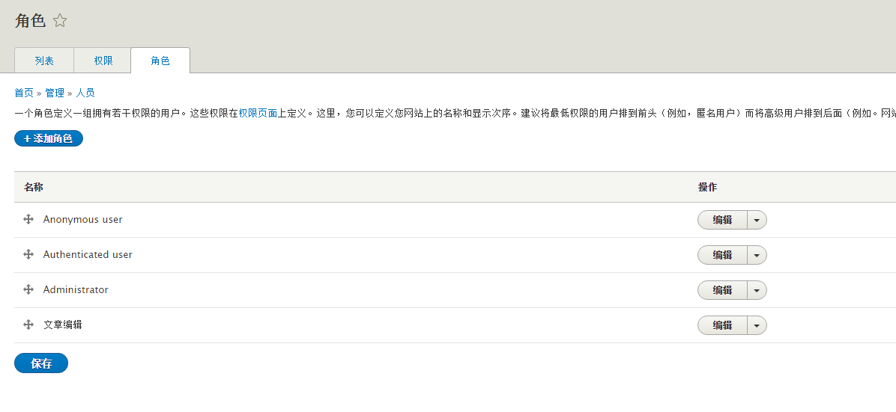

我们先创建一个“文章编辑”的角色，然后在 `人员-权限` 中，就可以对“文章编辑”的权限进行设置了（因为这里权限类别太多，三言两语也讲不清楚，所以建议真正想了解清楚的用管理员账号对“文章编辑”账号边改权限边进行测试，一遍下来就大致了解了这些权限的用处）。

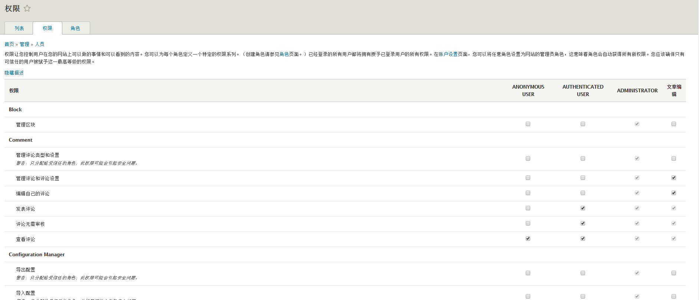

这里解释一下为什么在上面说“HTML代码用完全的HTML格式，文章编辑用基本的HTML格式”

首先，基本的HTML格式的标签支持较少，而且会自动给你的html代码进行“Debug”，等你保存完毕，查看页面的时候效果总是不到位，再次点开源码你就会发现你的源码进行了一次“韩国三日游”，被整容之后自己都不认识自己了，所以html代码最好用“完整的HTML”格式。

而文章编辑为什么要用“基本的HTML”格式呢？因为这样可以区分基本页面与动态新闻页面，当我们在权限设置里把“文章编辑”的文本格式权限限定在“基本的HTML”以后，“文章编辑”账号在后台的内容页面里只能对文章类的内容进行编辑，基本页面的内容是没有权限进行操作的，避免了文章编辑人员对开发人员写好的基本页面进行误操作，同时一般“文章编辑”人员都是不懂HTML代码的，用“基本的HTML”格式能帮助他们自动进行代码补全，让编辑者可以只专注于文字编辑，一举两得。

- 账号创建

配置完权限以后，就可以在 `人员-列表` 中添加用户，比较简单。

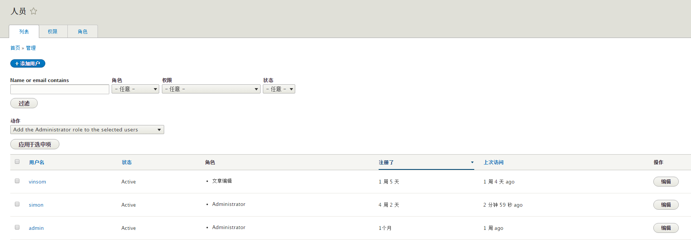

- 多语言

Drupal8的多语言配置可能和其他框架不太一样，

- 其他配置（站点名称、404页面等）

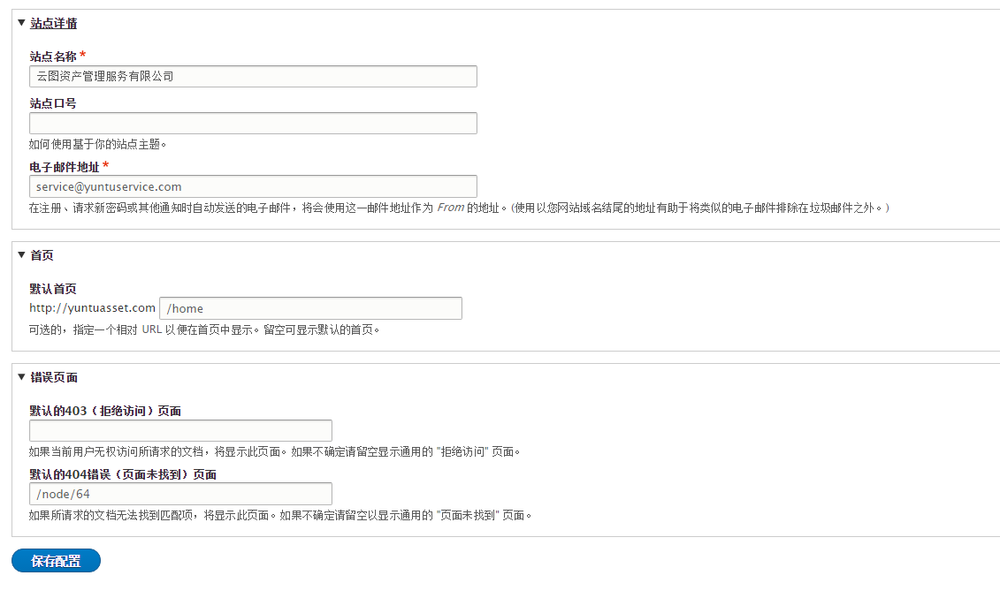

都很简单，把后台配置看一遍基本就会了，就不赘述了。

###7.其他功能

##结语

以上内容只是我在Drupal8的企业建站中一个人摸爬滚打总结的一点小经验，非常基础，适合和我一样对Drupal不甚了解的新朋友，有错误之处还请多多包涵。

而且因为本人暂时只涉猎了Drupal企业站的建站项目，所以这些思路目前仅适用于企业站点的搭建。当然，Drupal还有很多其他非常优秀的功能还没来得及仔细研究，比如评论、搜索、多语言等等，这些就需要大家自行探索了。

认真的说，以上这些内容其中只要有一点对你有帮助，那我写这么一大篇废话都是有意义的。

多谢观看~~~
